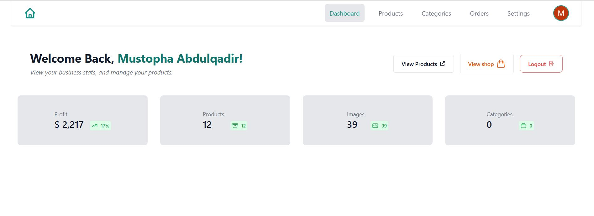

# NIYISTORES🛒

### _A simple e-commerce project built with React, Next.js, Tailwind CSS, MongoDB, Node.js, and Stripe._

---

---

This is a [Next.js](https://nextjs.org/) project bootstrapped with [`create-next-app`](https://github.com/vercel/next.js/tree/canary/packages/create-next-app).

## Table of Contents

- [Getting Started](#getting-started)
  - [Prerequisites](#prerequisites)
  - [Installation](#installation)
  - [Environment Variables](#environment-variables)
- [Usage](#usage)
- [Features](#features)
- [Technologies](#technologies)
- [Author](#author)
- [License](#license)

---

## Getting Started

Follow these instructions to set up and run the project locally.

### Prerequisites

Ensure you have the following installed on your machine:

- [Node.js](https://nodejs.org/en/download/) (v14 or later)
- [npm](https://www.npmjs.com/get-npm) (comes with Node.js)
- [MongoDB](https://www.mongodb.com/try/download/community) or a [MongoDB Atlas](https://www.mongodb.com/cloud/atlas) account

### Installation

1. **Clone the repository:**

   ```bash
   git clone https://github.com/Elmoustafi-22/niyistores-admin
   ```

2. **Navigate to the project directory:**

   ```bash
   cd niyistores-admin
   ```

3. **Install dependencies:**

   ```bash
   npm install
   ```

4. **Run the development server:**

   ```bash
   npm run dev
   ```

5. **Open the app in your browser:**

   Visit [http://localhost:3000](http://localhost:3000) to see the result.

---

### Environment Variables

Create a `.env` file in the root of your project and add the following environment variables:

```env
# Your Google OAuth2 Client ID for authentication
GOOGLE_ID="YOUR_GOOGLE_OAUTH2_CLIENT_ID"

# Your Google OAuth2 Client Secret key for authentication
GOOGLE_SECRET="YOUR_GOOGLE_OAUTH2_CLIENT_SECRET"

# MongoDB Connection String
MONGODB_URI="mongodb+srv://<username>:<password>@cluster.mongodb.net/<dbname>?retryWrites=true&w=majority"

# Cloudinary for image management
CLOUDINARY_CLOUD_NAME = "CLOUDINARY_CLOUD_NAME"
CLOUDINARY_API_KEY = "CLOUDINARY_API_KEY"
CLOUDINARY_API_SECRET = "CLOUDINARY_API_SECRET"
```

#### 1. Google OAuth2 Client ID and Client Secret

**How to Obtain:**

- Go to the [Google API Console](https://console.cloud.google.com/).
- Create a new project or select an existing one.
- Navigate to "Credentials" in the sidebar.
- Click "Create Credentials" and select "OAuth client ID" for a _Web application_.
- Follow the instructions to obtain your Client ID and Client Secret.

**Useful Links:**

- [Google API Console](https://console.cloud.google.com/)
- [Google OAuth2 Documentation](https://developers.google.com/identity/protocols/oauth2)

#### 2. Create a New MongoDB Database

**Steps:**

1. **Set Up MongoDB:**
   - Go to [MongoDB](https://www.mongodb.com/) and create an account if you haven't already.
   - Create a new project and set up a cluster (preferably using MongoDB Atlas for ease).

2. **Obtain Connection String:**
   - In your MongoDB Atlas dashboard, navigate to your cluster.
   - Click on "Connect" and follow the prompts to get your connection string.
   - Replace `<username>`, `<password>`, and `<dbname>` with your actual credentials and database name.

3. **Update `.env`:**
   - Add your MongoDB connection string to the `.env` file as shown above.

### 3. Set Up Cloudinary

**Steps:**

- Go to [Cloudinary](https://cloudinary.com/) and create a free account.
- After signing up, navigate to the Dashboard.
- Find your **Cloud Name**, **API Key**, and **API Secret** in the **Account Details** section.
- In your Next.js project, install the Cloudinary:
```bash
npm install cloudinary
```
- Update the `CLOUDINARY_CLOUD_NAME`, `CLOUDINARY_API_KEY` and `CLOUDINARY_API_SECRET` in `.env` file.

---

## Usage

After setting up the environment variables and running the development server, you can start managing products, viewing business stats, and handling transactions via Stripe.

---

## Features

- **User Authentication:** Secure login using Google OAuth2.
- **Product Management:** Create, read, update, and delete products.
- **Real-time Updates:** Changes in the database are reflected in the admin panel instantly.
- **Image Management:** Efficient image uploads and management using Cloudinary.
- **Responsive Design:** Built with Tailwind CSS for a mobile-friendly interface.
- **MongoDB Integration:** Robust database management with MongoDB.

---

## Technologies

- **Frontend:**
  - [React](https://reactjs.org/)
  - [Next.js](https://nextjs.org/)
  - [Tailwind CSS](https://tailwindcss.com/)

- **Backend:**
  - [Node.js](https://nodejs.org/)
  - [NextAuth.js](https://next-auth.js.org/) for authentication

- **Database:**
  - [MongoDB](https://www.mongodb.com/)
  - [Mongoose](https://mongoosejs.com/)

- **Image Management:**
  - [Cloudinary](https://cloudinary.com/)

- **Other:**
  - [Axios](https://axios-http.com/) for HTTP requests

---

## Author

**Mustopha Abdulqadir**

Solo Developer of NIYISTORES🛒

- [Twitter](https://twitter.com/_mustopha)
- [LinkedIn](https://www.linkedin.com/in/elmoustafi)

Feel free to reach out!

---

## License

This project is licensed under the [MIT License](LICENSE).
